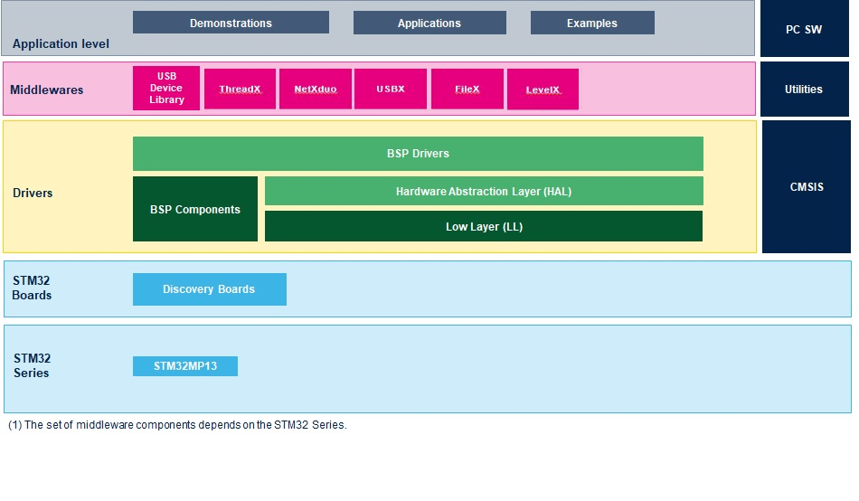

::: {.row}
::: {.col-sm-12 .col-lg-4}

# Release Notes for <mark>STM32CubeMP13 Firmware Package</mark>
Copyright &copy; 2023 STMicroelectronics\
    
{.logo}

# Purpose

[STMCube is an STMicroelectronics original initiative to ease developers life by reducing development efforts, time and cost.]{style="font-weight: bold;"}

STM32Cube covers STM32 portfolio.

STM32Cube Version 1.x includes:

- A comprehensive embedded software platform, delivered per series (such as STM32CubeMP13 for STM32MP13 series)

    - The STM32Cube HAL, an STM32 abstraction layer embedded software, ensuring maximized portability across STM32 portfolio
	
	- Low-layer APIs (LL) offering a fast light-weight expert-oriented layer which is closer to the hardware than the HAL. LL APIs are available only for a set of peripherals.

    - A list of projects are delivered (templates, Examples and Application)

	- A consistent set of middleware libraries such as ThreadX, FileX, USBX, NetDuoX, USB Device and Host,

- The STM32CubeMX (a graphical software configuration tool that allows to generate C initialization code using graphical wizards) is not included in this offer.

The STM32Cube firmware solution offers a straightforward API with a modular architecture, making it simple to fine tune custom applications and scalable to fit most requirements.

The **drivers** provided within this package **support** the **STM32MP131/133/135 lines.**

:::

::: {.col-sm-12 .col-lg-8}
# Update history

::: {.collapse}
<input type="checkbox" id="collapse-section0" checked aria-hidden="true">
<label for="collapse-section0" aria-hidden="true">__V1.1.0 / 23-Feb-2024__</label>

			

## Main changes

This release is the **Major Maintenance DV of STM32CubeMP13** Firmware Package

  - This is the delivery for STM32MP13 BareMetal 

## Contents

<small>The Project categories flagged by "[]{.icon-st-update}" have changed
since the previous release. "[]{.icon-st-add}" are new.</small>

### **Projects**

The **STM32CubeMP13** Firmware package comes with template running on STMicroelectronics boards, organized by board and provided with
preconfigured projects for the main supported toolchains.

The exhaustive list of projects is provided in this table [STM32CubeProjectsList.html](Projects/STM32CubeProjectsList.html)

This release contains almost HAL drivers, BSP drivers, templates, projects and examples.

  Name                                                Version                          Release notes
  -------------------------------------------------- -------------------------------  ---------------------------------------------
    Projects                                            V1.1.0                          [release notes](Projects/Release_Notes.html)  
	  **STM32MP135C-DK**                                []{.icon-st-update} 
	         -  Applications                            []{.icon-st-update}
             -  External Loader                         []{.icon-st-update}			 
	         -  Examples                                []{.icon-st-update}      
	         -  BSP Template 900MHz                     []{.icon-st-update}  
			 -  BSP Template                            []{.icon-st-update} 
      **STM32MP13XX_CUSTOM_HW**                           
	         -  Applications                            []{.icon-st-update} 
             -  External Loader                         []{.icon-st-update}			 			 
	         -  Examples                                []{.icon-st-update}      
			 -  BSP Template                            []{.icon-st-update}  

### **Components**

<small>The components flagged by "[]{.icon-st-update}" have changed since the
previous release. "[]{.icon-st-add}" are new.</small>

  
  Name                                                 Version                                          Release note
  --------------------------------------------------  -------------------------------                  --------------------------------------------------------------------------
    CMSIS		                                       V5.8.0                                           [release notes](Drivers/CMSIS/README.md)
    STM32MP13xx CMSIS                                  V1.1.0 []{.icon-st-update}                       [release notes](Drivers/CMSIS/Device/ST/STM32MP13xx/Release_Notes.html)
    STM32MP13xx HAL                                    V1.1.0 []{.icon-st-update}                       [release notes](Drivers/STM32MP13xx_HAL_Driver/Release_Notes.html)
    BSP STM32MP13xx DISCO                              V1.1.0 []{.icon-st-update}                       [release notes](Drivers/BSP/STM32MP13xx_DISCO/Release_Notes.html)
    BSP mcp23x17                                       V1.0.1 []{.icon-st-update}                       [release notes](Drivers/BSP/Components/mcp23x17/Release_Notes.html)
    BSP rk043fn48h                                     V1.0.4 []{.icon-st-update}                       [release notes](Drivers/BSP/Components/rk043fn48h/Release_Notes.html)
    BSP lan8742                                        V1.0.2                                           [release notes](Drivers/BSP/Components/lan8742/Release_Notes.html)
	BSP stmipid02									   V0.0.1               		                    [release notes](Drivers/BSP/Components/stmipid02/Release_Notes.html)
	BSP gc2145										   V1.0.0 []{.icon-st-update}	                    [release notes](Drivers/BSP/Components/gc2145/Release_Notes.html)
	BSP gt911										   V1.0.1 []{.icon-st-add}  	                    [release notes](Drivers/BSP/Components/gt911/Release_Notes.html)
	
  : **Drivers**

  Name                                                 Version                                          Release note
  --------------------------------------------------  -------------------------------------------      --------------------------------------------------------------------------------------------
  ThreadX                                              threadx-6.2.0.221223 + fix for thumb mode		[release notes](https://github.com/azure-rtos/threadx/releases/tag/v6.2.0_rel)
  NetXduo                                              netxduo-6.2.0.221223                             [release notes](https://github.com/azure-rtos/netxduo/releases/tag/v6.2.0_rel)
  USBX                                                 usbx-6.2.0.221223                                [release notes](https://github.com/azure-rtos/usbx/releases/tag/v6.2.0_rel)
  FileX                                                filex-6.2.0.221223                               [release notes](https://github.com/azure-rtos/filex/releases/tag/v6.2.0_rel)
  LevelX                                               levelx-6.2.0.221223 + fix NAND with ECC          [release notes](https://github.com/azure-rtos/levelx/releases/tag/v6.2.0_rel) 
  cmsis_rtos_threadx                                   tx-cmsis-1.1.0.220930                            [release notes](Middlewares/ST/cmsis_rtos_threadx/Release_Notes.html)
  STM32 USB Device Library                             v2.10.0                                          [release notes](Middlewares/ST/STM32_USB_Device_Library/Release_Notes.html)
  STM32 USB Host Library                               v3.5.1 []{.icon-st-update}                       [release notes](Middlewares/ST/STM32_USB_Host_Library/Release_Notes.html)

  : **Middlewares**

  Name                                                 Version                                          Release note
  --------------------------------------------------  -------------------------------------------      --------------------------------------------------------------------------------------------
  Fonts                                                V2.0.4 []{.icon-st-update}               		[release notes](Utilities/Fonts/Release_Notes.html)
  lcd                                                  V2.1.0 []{.icon-st-add}                          [release notes](Utilities/lcd/Release_Notes.html)
  ImageHeader                                          V1.4.0 []{.icon-st-update}                       [release notes](Utilities/ImageHeader/Readme_STM32MP1xx.txt)

  : **Utilities**

## Known Limitations

- None

## Development toolchains and compilers

- **The current default IDE = STM32CubeIDE**
  - All-in-one multi-OS development tool STM32CubeIDE: **v1.15.0**: [[link](https://www.st.com/en/development-tools/stm32cubeide.html)]{style="font-color: blue;"} 
   - gcc toolchain version =  12.13.rel1  

- IAR Embedded Workbench for ARM (EWARM): **v9.50** refer IAR update here: [[link](https://updates.iar.com/?key=efb1b60fa45540679f534ddaabdb7410&version=9.50)]{style="font-color: blue;"} 

## Supported devices and boards

- The delivery provided support the following devices :
  - STM32MP131xx, STM32MP133xx and STM32MP135xx
- Boards supported:
  - STM32MP135F-DK
  (STM32MP13XX_CUSTOM_HW is an internal ST Board customized to test some feature not available on STM32MP135F-DK Board : ex FMC-NAND or XSPI NOR or eMMC)
  
## Backward compatibility

- None

## Dependencies

- None

:::

::: {.collapse}
<input type="checkbox" id="collapse-section8" aria-hidden="true">
<label for="collapse-section8" aria-hidden="true">__V1.0.0 / 01-Nov-2023__</label>

			

## Main changes

This release is the **Mass Market DV of STM32CubeMP13** Firmware Package

  - This is the delivery for STM32MP13 BareMetal 

## Contents

<small>The Project categories flagged by "[]{.icon-st-update}" have changed
since the previous release. "[]{.icon-st-add}" are new.</small>

### **Projects**

The **STM32CubeMP13** Firmware package comes with template running on STMicroelectronics boards, organized by board and provided with
preconfigured projects for the main supported toolchains.

The exhaustive list of projects is provided in this table [STM32CubeProjectsList.html](Projects/STM32CubeProjectsList.html)

This release contains almost HAL drivers, BSP drivers, templates, projects and examples.

  Name                                                Version                          Release notes
  -------------------------------------------------- -------------------------------  ---------------------------------------------
    Projects                                            V1.0.0                          [release notes](Projects/Release_Notes.html)  
	  **STM32MP135C-DK**                                []{.icon-st-update} 
	         -  Applications                            []{.icon-st-update}
             -  External Loader                         []{.icon-st-add}			 
	         -  Examples                                []{.icon-st-update}      
	         -  BSP Template 900MHz                     []{.icon-st-update}  
			 -  BSP Template                            []{.icon-st-update} 
      **STM32MP13XX_CUSTOM_HW**                           
	         -  Applications                            []{.icon-st-update} 
             -  External Loader                         []{.icon-st-add}			 			 
	         -  Examples                                []{.icon-st-update}      
			 -  BSP Template                            []{.icon-st-update}  

### **Components**

<small>The components flagged by "[]{.icon-st-update}" have changed since the
previous release. "[]{.icon-st-add}" are new.</small>

  
  Name                                                 Version                         Release note
  --------------------------------------------------  -------------------------------  --------------------------------------------------------------------------
    CMSIS		                                       V5.8.0                          [release notes](Drivers/CMSIS/README.md)
    STM32MP13xx CMSIS                                  V1.0.0 []{.icon-st-update}      [release notes](Drivers/CMSIS/Device/ST/STM32MP13xx/Release_Notes.html)
    STM32MP13xx HAL                                    V1.0.0 []{.icon-st-update}      [release notes](Drivers/STM32MP13xx_HAL_Driver/Release_Notes.html)
    BSP STM32MP13xx DISCO                              V1.0.0 []{.icon-st-update}      [release notes](Drivers/BSP/STM32MP13xx_DISCO/Release_Notes.html)
    BSP mcp23x17                                       V1.0.0                          [release notes](Drivers/BSP/Components/mcp23x17/Release_Notes.html)
    BSP rk043fn48h                                     V1.0.3                          [release notes](Drivers/BSP/Components/rk043fn48h/Release_Notes.html)
    BSP lan8742                                        V1.0.2                          [release notes](Drivers/BSP/Components/lan8742/Release_Notes.html)
	BSP stmipid02									   V0.0.1               		   [release notes](Drivers/BSP/Components/stmipid02/Release_Notes.html)
	BSP gc2145										   V0.0.2 []{.icon-st-update}	   [release notes](Drivers/BSP/Components/gc2145/Release_Notes.html)
	
  : **Drivers**

  Name                                                 Version                                          Release note
  --------------------------------------------------  -------------------------------------------      --------------------------------------------------------------------------------------------
  ThreadX                                              threadx-6.2.0.221223 + fix for thumb mode		[release notes](https://github.com/azure-rtos/threadx/releases/tag/v6.2.0_rel)
  NetXduo                                              netxduo-6.2.0.221223                             [release notes](https://github.com/azure-rtos/netxduo/releases/tag/v6.2.0_rel)
  USBX                                                 usbx-6.2.0.221223                                [release notes](https://github.com/azure-rtos/usbx/releases/tag/v6.2.0_rel)
  FileX                                                filex-6.2.0.221223                               [release notes](https://github.com/azure-rtos/filex/releases/tag/v6.2.0_rel)
  LevelX                                               levelx-6.2.0.221223 + fix NAND with ECC          [release notes](https://github.com/azure-rtos/levelx/releases/tag/v6.2.0_rel) 
  cmsis_rtos_threadx                                   tx-cmsis-1.1.0.220930                            [release notes](Middlewares/ST/cmsis_rtos_threadx/Release_Notes.html)
  STM32 USB Device Library                             v2.10.0                                          [release notes](Middlewares/ST/STM32_USB_Device_Library/Release_Notes.html)
  STM32 USB Host Library                               v3.4.0                                           [release notes](Middlewares/ST/STM32_USB_Host_Library/Release_Notes.html)

  : **Middlewares**

## Known Limitations

- None

## Development toolchains and compilers

- **The current default IDE = STM32CubeIDE**
  - All-in-one multi-OS development tool STM32CubeIDE: **v1.12.1**: [[link](https://www.st.com/en/development-tools/stm32cubeide.html)]{style="font-color: blue;"} 
   - gcc toolchain version =  10.3-2021.10  

- IAR Templates not yet supported

## Supported devices and boards

- The delivery provided support the following devices :
  - STM32MP131xx, STM32MP133xx and STM32MP135xx
- Boards supported:
  - STM32MP135F-DK
  (STM32MP13XX_CUSTOM_HW is an internal ST Board customized to test some feature not available on STM32MP135F-DK Board : ex FMC-NAND or XSPI NOR)
  
## Backward compatibility

- None

## Dependencies

- None

:::

::: {.collapse}
<input type="checkbox" id="collapse-section7" aria-hidden="true">
<label for="collapse-section7" aria-hidden="true">__V0.7.0 / 27-June-2023__</label>

			

## Main changes

This release is the **5th ALPHA DV of STM32CubeMP13** Firmware Package

  - This is the delivery for STM32MP13 BareMetal 

## Contents

<small>The Project categories flagged by "[]{.icon-st-update}" have changed
since the previous release. "[]{.icon-st-add}" are new.</small>

### **Projects**

The **STM32CubeMP13** Firmware package comes with template running on STMicroelectronics boards, organized by board and provided with
preconfigured projects for the main supported toolchains.

The exhaustive list of projects is provided in this table [STM32CubeProjectsList.html](Projects/STM32CubeProjectsList.html)

This release contains almost HAL drivers, BSP drivers, templates, projects and examples.

  Name                                                Version                          Release notes
  -------------------------------------------------- -------------------------------  ---------------------------------------------
    Projects                                           V0.7.0                          [release notes](Projects/Release_Notes.html)  
	  **STM32MP135C-DK**                                []{.icon-st-update} 
	         -  Applications                            []{.icon-st-update}       
	         -  Examples                                []{.icon-st-update}      
	         -  BSP Template 900MHz                       
			 -  BSP Template  
      **STM32MP13XX_CUSTOM_HW**                         []{.icon-st-update}  
	         -  Applications                            []{.icon-st-update}       
	         -  Examples                                      
			 -  BSP Template                              

### **Components**

<small>The components flagged by "[]{.icon-st-update}" have changed since the
previous release. "[]{.icon-st-add}" are new.</small>

  
  Name                                                 Version                         Release note
  --------------------------------------------------  -------------------------------  --------------------------------------------------------------------------
    CMSIS		                                       V5.8.0                          [release notes](Drivers/CMSIS/README.md)
    STM32MP13xx CMSIS                                  V0.7.0 []{.icon-st-update}      [release notes](Drivers/CMSIS/Device/ST/STM32MP13xx/Release_Notes.html)
    STM32MP13xx HAL                                    V0.7.0 []{.icon-st-update}      [release notes](Drivers/STM32MP13xx_HAL_Driver/Release_Notes.html)
    BSP STM32MP13xx DISCO                              V0.7.0 []{.icon-st-update}      [release notes](Drivers/BSP/STM32MP13xx_DISCO/Release_Notes.html)
    BSP mcp23x17                                       V1.0.0                          [release notes](Drivers/BSP/Components/mcp23x17/Release_Notes.html)
    BSP rk043fn48h                                     V1.0.3                          [release notes](Drivers/BSP/Components/rk043fn48h/Release_Notes.html)
    BSP lan8742                                        V1.0.2                          [release notes](Drivers/BSP/Components/lan8742/Release_Notes.html)
	BSP stmipid02									   V0.0.1 []{.icon-st-add}		   [release notes](Drivers/BSP/Components/stmipid02/Release_Notes.html)
	BSP gc2145										   V0.0.2 []{.icon-st-add}		   [release notes](Drivers/BSP/Components/gc2145/Release_Notes.html)
	
  : **Drivers**

  Name                                                 Version                                          Release note
  --------------------------------------------------  -------------------------------------------      --------------------------------------------------------------------------------------------
  ThreadX                                              threadx-6.2.0.221223 + fix for thumb mode		[release notes](https://github.com/azure-rtos/threadx/releases/tag/v6.2.0_rel)
  NetXduo                                              netxduo-6.2.0.221223                             [release notes](https://github.com/azure-rtos/netxduo/releases/tag/v6.2.0_rel)
  USBX                                                 usbx-6.2.0.221223                                [release notes](https://github.com/azure-rtos/usbx/releases/tag/v6.2.0_rel)
  FileX                                                filex-6.2.0.221223                               [release notes](https://github.com/azure-rtos/filex/releases/tag/v6.2.0_rel)
  LevelX                                               levelx-6.2.0.221223 + fix NAND with ECC          [release notes](https://github.com/azure-rtos/levelx/releases/tag/v6.2.0_rel) 
  cmsis_rtos_threadx                                   tx-cmsis-1.1.0.220930                            [release notes](Middlewares/ST/cmsis_rtos_threadx/Release_Notes.html)
  STM32 USB Device Library                             v2.10.0                                          [release notes](Middlewares/ST/STM32_USB_Device_Library/Release_Notes.html)
  STM32 USB Host Library                               v3.4.0                                           [release notes](Middlewares/ST/STM32_USB_Host_Library/Release_Notes.html)

  : **Middlewares**

## Known Limitations

- None

## Development toolchains and compilers

- **The current default IDE = STM32CubeIDE**
  - All-in-one multi-OS development tool STM32CubeIDE: **v1.12.1**: [[link](https://www.st.com/en/development-tools/stm32cubeide.html)]{style="font-color: blue;"} 
   - gcc toolchain version =  10.3-2021.10  

- IAR Templates not yet available

## Supported devices and boards

- The delivery provided support the following devices :
  - STM32MP131xx, STM32MP133xx and STM32MP135xx
- Boards supported:
  - STM32MP135F-DK
  (STM32MP13XX_CUSTOM_HW is an internal ST Board customized to test some feature not available on STM32MP135F-DK Board : ex FMC-NAND or QSPi NOR)
  
## Backward compatibility

- None

## Dependencies

- None

:::

::: {.collapse}
<input type="checkbox" id="collapse-section6" aria-hidden="true">
<label for="collapse-section6" aria-hidden="true">__V0.6.0 / 16-December-2022__</label>

			

## Main changes

This release is the **4th ALPHA DV of STM32CubeMP13** Firmware Package

  - This is the delivery for STM32MP13 BareMetal 

## Contents

<small>The Project categories flagged by "[]{.icon-st-update}" have changed
since the previous release. "[]{.icon-st-add}" are new.</small>

### **Projects**

The **STM32CubeMP13** Firmware package comes with template running on STMicroelectronics boards, organized by board and provided with
preconfigured projects for the main supported toolchains.

The exhaustive list of projects is provided in this table [STM32CubeProjectsList.html](Projects/STM32CubeProjectsList.html)

This release contains almost HAL drivers, BSP drivers, templates, projects and examples.

  Name                                                Version                          Release notes
  -------------------------------------------------- -------------------------------  ---------------------------------------------
    Projects                                           V0.6.0                          [release notes](Projects/Release_Notes.html)  
	  **STM32MP135C-DK**                                []{.icon-st-update} 
	         -  Applications                            []{.icon-st-update}       
	         -  Examples                                []{.icon-st-update}      
	         -  BSP Template 900MHz                       
			 -  BSP Template                              
      **STM32MP13XX_CUSTOM_HW**                         []{.icon-st-add}  
	         -  Applications                            []{.icon-st-add}       
	         -  Examples                                []{.icon-st-add}      
			 -  BSP Template                            []{.icon-st-add}  

### **Components**

<small>The components flagged by "[]{.icon-st-update}" have changed since the
previous release. "[]{.icon-st-add}" are new.</small>

  
  Name                                                 Version                         Release note
  --------------------------------------------------  -------------------------------  --------------------------------------------------------------------------
    CMSIS		                                       V5.8.0                          [release notes](Drivers/CMSIS/README.md)
    STM32MP13xx CMSIS                                  V0.6.0 []{.icon-st-update}      [release notes](Drivers/CMSIS/Device/ST/STM32MP13xx/Release_Notes.html)
    STM32MP13xx HAL                                    V0.6.0 []{.icon-st-update}      [release notes](Drivers/STM32MP13xx_HAL_Driver/Release_Notes.html)
    BSP STM32MP13xx DISCO                              V0.6.0 []{.icon-st-update}      [release notes](Drivers/BSP/STM32MP13xx_DISCO/Release_Notes.html)
    BSP mcp23x17                                       V1.0.0                          [release notes](Drivers/BSP/Components/mcp23x17/Release_Notes.html)
    BSP rk043fn48h                                     V1.0.3                          [release notes](Drivers/BSP/Components/rk043fn48h/Release_Notes.html)
    BSP lan8742                                        V1.0.2                          [release notes](Drivers/BSP/Components/lan8742/Release_Notes.html)
	
  : **Drivers**

  Name                                                 Version                                          Release note
  --------------------------------------------------  -------------------------------------------      --------------------------------------------------------------------------------------------
  ThreadX                                              threadx-6.1.12.220930-iso []{.icon-st-update}    [release notes](https://github.com/azure-rtos/threadx/releases/tag/v6.1.12_rel)
  NetXduo                                              netxduo-6.1.12.220930 []{.icon-st-update}        [release notes](https://github.com/azure-rtos/netxduo/releases/tag/v6.1.12_rel)
  USBX                                                 usbx-6.1.12.220930 []{.icon-st-update}           [release notes](https://github.com/azure-rtos/usbx/releases/tag/v6.1.12_rel)
  FileX                                                filex-6.1.12.220930 []{.icon-st-update}          [release notes](https://github.com/azure-rtos/filex/releases/tag/v6.1.12_rel)
  LevelX                                               levelx-6.1.12.220930 []{.icon-st-update}         [release notes](https://github.com/azure-rtos/levelx/releases/tag/v6.1.12_rel) 
  cmsis_rtos_threadx                                   tx-cmsis-1.1.0.220930 []{.icon-st-update}        [release notes](Middlewares/ST/cmsis_rtos_threadx/Release_Notes.html)
  STM32 USB Device Library                             v2.10.0                                          [release notes](Middlewares/ST/STM32_USB_Device_Library/Release_Notes.html)
  STM32 USB Host Library                               v3.4.0                                           [release notes](Middlewares/ST/STM32_USB_Host_Library/Release_Notes.html)

  : **Middlewares**

## Known Limitations

- Driver FMC_NAND : only ECC BCH4 has been validated ( BCH8 and Haming code is implemented , but not yet tested)
- **Almost provided API** may be subject to update in the coming releases

## Development toolchains and compilers

- **The current default IDE = STM32CubeIDE**
  - All-in-one multi-OS development tool STM32CubeIDE: **v1.11.0**: [[link](https://www.st.com/en/development-tools/stm32cubeide.html)]{style="font-color: blue;"} []{.icon-st-update}
   - gcc toolchain version =  10.3-2021.10 []{.icon-st-update} 

- IAR Templates not yet available

## Supported devices and boards

- The delivery provided support the following devices :
  - STM32MP131xx, STM32MP133xx and STM32MP135xx
- Boards supported:
  - STM32MP135F-DK
  (STM32MP13XX_CUSTOM_HW is an internal ST Board customized to test some feature not available on STM32MP135F-DK Board : ex FMC-NAND or QSPi NOR)
  
## Backward compatibility

- None

## Dependencies

- None

:::

::: {.collapse}
<input type="checkbox" id="collapse-section5" aria-hidden="true">
<label for="collapse-section5" aria-hidden="true">__V0.5.0 / 29-June-2022__</label>

			

## Main changes

This release is the **3rd ALPHA DV of STM32CubeMP13** Firmware Package

  - This is the delivery for STM32MP13 BareMetal 

## Contents

<small>The Project categories flagged by "[]{.icon-st-update}" have changed
since the previous release. "[]{.icon-st-add}" are new.</small>

### **Projects**

The **STM32CubeMP13** Firmware package comes with template running on STMicroelectronics boards, organized by board and provided with
preconfigured projects for the main supported toolchains.
The exhaustive list of projects is provided in this table [STM32CubeProjectsList.html](Projects/STM32CubeProjectsList.html)

This release contains almost HAL drivers, BSP drivers, templates, projects and examples.

  Name                                                Version                          Release notes
  -------------------------------------------------- -------------------------------  ---------------------------------------------
    Projects STM32MP135C-DK                            V0.5.0                          [release notes](Projects/Release_Notes.html)  
	         - Applications                              []{.icon-st-add}       
	         - Examples                                  []{.icon-st-add}      
	         - BSP Template 900MHz                       []{.icon-st-update}      
			 - BSP Template                              []{.icon-st-update}     

### **Components**

<small>The components flagged by "[]{.icon-st-update}" have changed since the
previous release. "[]{.icon-st-add}" are new.</small>

  
  Name                                                 Version                         Release note
  --------------------------------------------------  -------------------------------  --------------------------------------------------------------------------
    CMSIS			                                   V5.8.0 []{.icon-st-update}      [release notes](Drivers/CMSIS/docs/General/html/index.html)
    STM32MP13xx CMSIS                                  V0.5.0 []{.icon-st-update}      [release notes](Drivers/CMSIS/Device/ST/STM32MP13xx/Release_Notes.html)
    STM32MP13xx HAL                                    V0.5.0 []{.icon-st-update}      [release notes](Drivers/STM32MP13xx_HAL_Driver/Release_Notes.html)
    BSP STM32MP13xx DISCO                              V0.5.0 []{.icon-st-update}      [release notes](Drivers/BSP/STM32MP13xx_DISCO/Release_Notes.html)
    BSP mcp23x17                                       V1.0.0                          [release notes](Drivers/BSP/Components/mcp23x17/Release_Notes.html)
    BSP rk043fn48h                                     V1.0.3                          [release notes](Drivers/BSP/Components/rk043fn48h/Release_Notes.html)
    BSP lan8742                                        V1.0.2 []{.icon-st-add}         [release notes](Drivers/BSP/Components/lan8742/Release_Notes.html)
	
  : **Drivers**

  Name                                                 Version                                          Release note
  --------------------------------------------------  -------------------------------------------      --------------------------------------------------------------------------------------------
  ThreadX                                              threadx-6.1.9.211213-iso []{.icon-st-add}        [release notes](https://github.com/azure-rtos/threadx/releases/tag/v6.1.9_rel)
  NetXduo                                              netxduo-6.1.10.220513 []{.icon-st-add}           [release notes](https://github.com/azure-rtos/netxduo/releases/tag/v6.1.10_rel)
  USBX                                                 usbx-6.1.10.220401 []{.icon-st-add}              [release notes](https://github.com/azure-rtos/usbx/releases/tag/v6.1.10_rel)
  FileX                                                filex-6.1.10.220401 []{.icon-st-add}             [release notes](https://github.com/azure-rtos/filex/releases/tag/r6.1.10_rel)
  LevelX                                               levelx-6.1.10.220401 []{.icon-st-add}            [release notes](https://github.com/azure-rtos/levelx/releases/tag/v6.1.10_rel) 
  cmsis_rtos_threadx                                   tx-cmsis-1.0.1.210621 []{.icon-st-add}           [release notes](Middlewares/ST/cmsis_rtos_threadx/Release_Notes.html)
  STM32 USB Device Library                             v2.10.0 []{.icon-st-add}                         [release notes](Middlewares/ST/STM32_USB_Device_Library/Release_Notes.html)
  STM32 USB Host Library                               v3.4.0 []{.icon-st-add}                          [release notes](Middlewares/ST/STM32_USB_Host_Library/Release_Notes.html)

  : **Middlewares**

## Known Limitations

- **Almost provided API** may be subject to update in the coming releases
- ETH / NetXduo applications not yet at ALPHA Level: these limitations will be fixed in future releases.
  - ETH driver maturation to improve
  - The NetXduo applications lead to potential instabilities and performance issues. 
  - LED management for status to update

## Development toolchains and compilers

- **The current default IDE = STM32CubeIDE**
  - All-in-one multi-OS development tool STM32CubeIDE: **v1.10.0**: [[link](https://www.st.com/en/development-tools/stm32cubeide.html)]{style="font-color: blue;"} []{.icon-st-update}
  ( this delivery is not compatible with older version)
  - gcc toolchain version =  10.3-2021.10 []{.icon-st-update} 

## Supported devices and boards

- The delivery provided support the following devices :
  - STM32MP131xx, STM32MP133xx and STM32MP135xx
- Boards supported:
  - STM32MP135F-DK

## Backward compatibility

- None

## Dependencies

- None

:::

::: {.collapse}
<input type="checkbox" id="collapse-section4" aria-hidden="true">
<label for="collapse-section4" aria-hidden="true">__V0.4.0 / 04-March-2022__</label>

			

## Main changes

This release is the **2nd ALPHA DV of STM32CubeMP13** Firmware Package

  - **Cut1.1** support / HAL Driver Maturation

## Contents

<small>The Project categories flagged by "[]{.icon-st-update}" have changed
since the previous release. "[]{.icon-st-add}" are new.</small>

### **Projects**

The **STM32CubeMP13** Firmware package comes with template running on STMicroelectronics boards, organized by board and provided with
preconfigured projects for the main supported toolchains.
The exhaustive list of projects is provided in this table [STM32CubeProjectsList.html](Projects/STM32CubeProjectsList.html)

This release contains almost HAL drivers, BSP drivers, templates, projects and examples.

  Name                                                Version                          Release notes
  -------------------------------------------------- -------------------------------  ---------------------------------------------
    Projects STM32MP135C-DK                            V0.4.0                          [release notes](Projects/Release_Notes.html)  
	         - Applications                              []{.icon-st-update}      
	         - Examples                                  []{.icon-st-add}      
	         - BSP Template 900MHz                       []{.icon-st-update}      
			 - BSP Template                              []{.icon-st-update}     

### **Components**

<small>The components flagged by "[]{.icon-st-update}" have changed since the
previous release. "[]{.icon-st-add}" are new.</small>

  
  Name                                                 Version                         Release note
  --------------------------------------------------  -------------------------------  --------------------------------------------------------------------------
    CMSIS			                                   V5.6.0 []{.icon-st-update}      [release notes](Drivers/CMSIS/docs/General/html/index.html)
    STM32MP13xx CMSIS                                  V0.4.0 []{.icon-st-update}      [release notes](Drivers/CMSIS/Device/ST/STM32MP13xx/Release_Notes.html)
    STM32MP13xx HAL                                    V0.4.0 []{.icon-st-update}      [release notes](Drivers/STM32MP13xx_HAL_Driver/Release_Notes.html)
    BSP STM32MP13xx DISCO                              V0.4.0 []{.icon-st-update}      [release notes](Drivers/BSP/STM32MP13xx_DISCO/Release_Notes.html)
    BSP mcp23x17                                       V1.0.0                          [release notes](Drivers/BSP/Components/mcp23x17/Release_Notes.html)
    BSP rk043fn48h                                     V1.0.3                          [release notes](Drivers/BSP/Components/rk043fn48h/Release_Notes.html)

  : **Drivers**

  Name                                                 Version                         Release note
  --------------------------------------------------  -------------------------------  --------------------------------------------------------------------------------------------
  STM32 USB Device Library                             v2.10.0 []{.icon-st-add}        [release notes](Middlewares/ST/STM32_USB_Device_Library/Release_Notes.html)

  : **Middlewares**

## Known Limitations

- **Almost provided API** may be subject to update in the coming releases

## Development toolchains and compilers

- **STM32CubeIDE** is the promoted toolchain (version used v1.7.0).
- gcc toolchain version =  9-2020-q2  

## Supported devices and boards

- STM32MP13xx devices Cut1.0 and **Cut1.1**

## Backward compatibility

- None

## Dependencies

- None

:::

::: {.collapse}
<input type="checkbox" id="collapse-section3" aria-hidden="true">
<label for="collapse-section3" aria-hidden="true">__V0.3.0 / 03-December-2021__</label>

			

## Main changes

This release is the **ALPHA DV of STM32CubeMP13** Firmware Package

## Contents

<small>The Project categories flagged by "[]{.icon-st-update}" have changed
since the previous release. "[]{.icon-st-add}" are new.</small>

### **Projects**

The **STM32CubeMP13** Firmware package comes with template running on STMicroelectronics boards, organized by board and provided with
preconfigured projects for the main supported toolchains.
The exhaustive list of projects is provided in this table [STM32CubeProjectsList.html](Projects/STM32CubeProjectsList.html)

This release contains almost HAL drivers, BSP drivers, templates, projects and examples.

  Name                                                Version                          Release notes
  -------------------------------------------------- -------------------------------  ---------------------------------------------
    Projects STM32MP135C-DK                            V0.3.0                          [release notes](Projects/Release_Notes.html)  
	         - Applications                              []{.icon-st-add}      
	         - Examples                                  []{.icon-st-add}      
	         - BSP Template 900MHz                       []{.icon-st-add}      
			 - BSP Template

### **Components**

<small>The components flagged by "[]{.icon-st-update}" have changed since the
previous release. "[]{.icon-st-add}" are new.</small>

  
  Name                                                 Version                         Release note
  --------------------------------------------------  -------------------------------  --------------------------------------------------------------------------
    CMSIS			                                   V5.6.0 []{.icon-st-update}      [release notes](Drivers/CMSIS/docs/General/html/index.html)
    STM32MP13xx CMSIS                                  V0.3.0 []{.icon-st-update}      [release notes](Drivers/CMSIS/Device/ST/STM32MP13xx/Release_Notes.html)
    STM32MP13xx HAL                                    V0.3.0 []{.icon-st-update}      [release notes](Drivers/STM32MP13xx_HAL_Driver/Release_Notes.html)
    BSP STM32MP13xx DISCO                              V0.3.0 []{.icon-st-update}      [release notes](Drivers/BSP/STM32MP13xx_DISCO/Release_Notes.html)
    BSP mcp23x17                                       V1.0.0 []{.icon-st-add}         [release notes](Drivers/BSP/Components/mcp23x17/Release_Notes.html)
    BSP rk043fn48h                                     V1.0.3 []{.icon-st-add}         [release notes](Drivers/BSP/Components/rk043fn48h/Release_Notes.html)

  : **Drivers**

  Name                                                 Version                         Release note
  --------------------------------------------------  -------------------------------  --------------------------------------------------------------------------------------------
  STM32 USB Device Library                             v2.10.0 []{.icon-st-add}        [release notes](Middlewares/ST/STM32_USB_Device_Library/Release_Notes.html)

  : **Middlewares**

## Known Limitations

- **CRYP/SAES ported in same driver** but 
  - Some SAES features still under maturation
  - Transfer with MDMA not fully functional
- **Almost provided API** may be subject to update in the coming releases
- LL drivers implemented : **only LL_ADC** ( as required for HAL ADC driver)

## Development toolchains and compilers

- **STM32CubeIDE** is the promoted toolchain (version used v1.7.0).

## Supported devices and boards

- STM32MP13xx devices Cut1.0

## Backward compatibility

- None

## Dependencies

- None

:::

::: {.collapse}
<input type="checkbox" id="collapse-section2" aria-hidden="true">
<label for="collapse-section2" aria-hidden="true">__V0.2.0 / 09-June-2021__</label>

			

## Main changes

This release is the **PRE-ALPHA DV of STM32CubeMP13** Firmware Package

## Contents

<small>The Project categories flagged by "[]{.icon-st-update}" have changed
since the previous release. "[]{.icon-st-add}" are new.</small>

### **Projects**

The **STM32CubeMP13** Firmware package comes with template running on STMicroelectronics boards, organized by board and provided with
preconfigured projects for the main supported toolchains.
The exhaustive list of projects is provided in this table [STM32CubeProjectsList.html](Projects/STM32CubeProjectsList.html)

This release contains almost HAL drivers, BSP drivers, templates, projects and examples.

  Name                                                Version                          Release notes
  -------------------------------------------------- -------------------------------  ---------------------------------------------
    Projects STM32MP135C-DK                            V0.2.0                          [release notes](Projects/Release_Notes.html)  
	         - BSP Template                               []{.icon-st-update}      

### **Components**

<small>The components flagged by "[]{.icon-st-update}" have changed since the
previous release. "[]{.icon-st-add}" are new.</small>

  
  Name                                                 Version                         Release note
  --------------------------------------------------  -------------------------------  --------------------------------------------------------------------------
    CMSIS		                                       V5.4.0                          [release notes](Drivers/CMSIS/docs/General/html/index.html)
    STM32MP13xx CMSIS                                  V0.2.0 []{.icon-st-update}      [release notes](Drivers/CMSIS/Device/ST/STM32MP13xx/Release_Notes.html)
    STM32MP13xx HAL                                    V0.2.0 []{.icon-st-update}      [release notes](Drivers/STM32MP13xx_HAL_Driver/Release_Notes.html)
    BSP STM32MP13xx DISCO                              V0.2.0 []{.icon-st-update}      [release notes](Drivers/BSP/STM32MP13xx_DISCO/Release_Notes.html)

  : **Drivers**

## Known Limitations

- **Only SAES algo** in CRYP driver ( CRYP or AES algo will be delivered later)
- LL drivers implemented : **only LL_ADC** ( as required for HAL ADC driver)
- **Almost provided API may be subject to update in the coming releases**

## Development toolchains and compilers

- **STM32CubeIDE** is the promoted toolchain (version used v1.6.0).

## Supported devices and boards

- STM32MP13xx devices Cut1.0

## Backward compatibility

- None

## Dependencies

- None

:::

::: {.collapse}
<input type="checkbox" id="collapse-section1" aria-hidden="true">
<label for="collapse-section1" aria-hidden="true">__V0.1.0 / 20-April-2021__</label>

			

## Main changes

This release is the **BRING UP DV of STM32CubeMP13** Firmware Package

## Contents

<small>The Project categories flagged by "[]{.icon-st-update}" have changed
since the previous release. "[]{.icon-st-add}" are new.</small>

### **Projects**

The **STM32CubeMP13** Firmware package comes with template running on STMicroelectronics boards, organized by board and provided with
preconfigured projects for the main supported toolchains.
The exhaustive list of projects is provided in this table [STM32CubeProjectsList.html](Projects/STM32CubeProjectsList.html)

This release contains almost HAL drivers, BSP drivers, templates, projects and examples.

  Name                                                Version                          Release notes
  -------------------------------------------------- -------------------------------  ---------------------------------------------
    Projects STM32MP135C-DK                            V0.1.0                          [release notes](Projects/Release_Notes.html)  
	         - BSP Template                               []{.icon-st-add}      

### **Components**

<small>The components flagged by "[]{.icon-st-update}" have changed since the
previous release. "[]{.icon-st-add}" are new.</small>

  
  Name                                                 Version                         Release note
  --------------------------------------------------  -------------------------------  --------------------------------------------------------------------------
    CMSIS		                                       V5.4.0                          [release notes](Drivers/CMSIS/docs/General/html/index.html)
    STM32MP13xx CMSIS                                  V0.1.0 []{.icon-st-update}      [release notes](Drivers/CMSIS/Device/ST/STM32MP13xx/Release_Notes.html)
    STM32MP13xx HAL                                    V0.1.0 []{.icon-st-update}      [release notes](Drivers/STM32MP13xx_HAL_Driver/Release_Notes.html)
    BSP STM32MP13xx DISCO                              V0.1.0 []{.icon-st-update}      [release notes](Drivers/BSP/STM32MP13xx_DISCO/Release_Notes.html)

  : **Drivers**

## Known Limitations

- **Only SAES algo** in CRYP driver ( CRYP or AES algo will be delivered later)
- **Almost provided API may be subject to update in the coming releases**
  - The driver validation on silicon is just started

## Development toolchains and compilers

- **STM32CubeIDE** is the promoted toolchain (version used v1.6.0).

## Supported devices and boards

- STM32MP13xx devices Cut1.0 (silicon validation not started)

## Backward compatibility

- None

## Dependencies

- None

:::

:::
:::

<footer class="sticky">
::: {.columns}
::: {.column width="95%"}
For complete documentation on **\<SW or product family name\>** ,
visit: [[\<SW or product family URL\>](http://www.st.com/STM32)]{style="background-color: yellow;"}
:::
::: {.column width="5%"}
<abbr title="Based on template cx626901 version 2.1">Info</abbr>
:::
:::
</footer>
